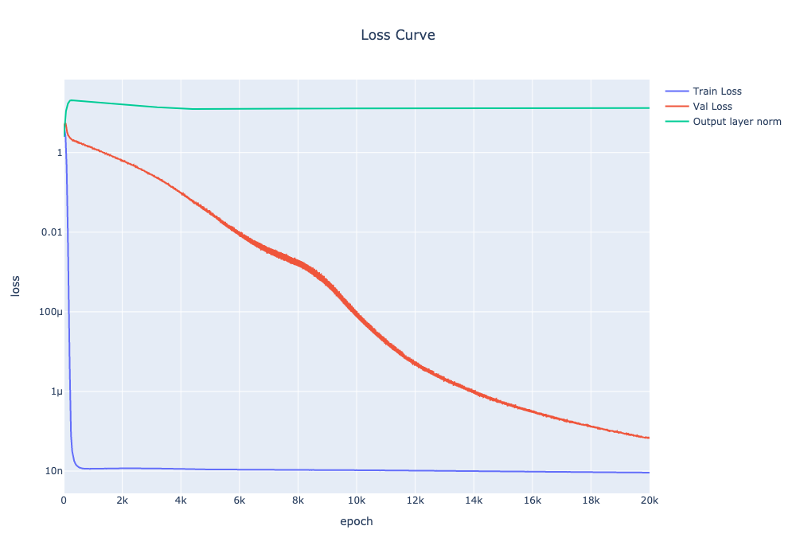
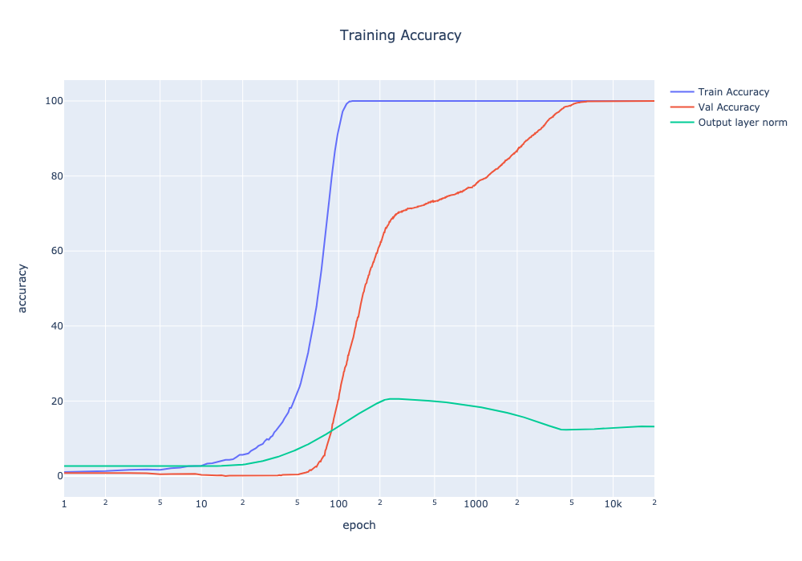

# Grokking MLP

This repo explores the grokking phenomenon that appears in neural networks trained on small datasets over many optimization steps. The code here replicates some of the results in OpenAI's Grokking paper: [Grokking: Generalization Beyond Overfitting on Small Algorithmic Datasets](https://arxiv.org/abs/2201.02177) and runs some experiments on variations of the idea. More related grokking papers are [The Slingshot Mechanism](https://arxiv.org/abs/2206.04817) and [Progress measures for grokking via mechanistic interpretability](https://arxiv.org/abs/2301.05217).

The grokking phenomenon is somethingt that occurs when training a neural network for a long period of time. Usually when training an overparameterized network on a small dataset the model will overfit the training data and fail to generalize to the validation data (i.e. very low training loss and very high validation loss). But, in some cases, when you continue training for a long period of time then the model will generalize and achieve perfect performance on the train and validation datasets. **The reason why this happens and if it can be exploited is an open question**.

The jupyter notebook `grokking-modadd.ipynb` is a playground notebook for building up experiments and was used for quick prototyping. The notebook demonstrates the grokking phenomenon on a simple MLP trained on a synthetically generated modular addition dataset. The rest of the `.py` files contain more structured code for running experiments.

## File Descriptions

* config.yaml: Configuration file for setting hyperparameters
* data.py: Creates synthetic datasets
* net.py: Defines the neural network architecture and set up loss function and optimizer
* plot.py: Contains helper functions for creating plots
* train.py: Main script used to train models and record results

## Experiment List

* **exp1**: Randomly split data into train and val set. Train over 100k optimization steps
* **exp2**: Randomly split data into train and val set. Train over 20k epochs
* **exp3**: Split data based on label (val set composed of data samples with labels 1 and 2). Train over 20k epochs
  * This is to see if the model will still grok (generalize) if it does not see certain data points. In other words, if it never sees any examples where the answer is 1 or 2, will it still learn the true underlying equation? Or will it learn a variant of it that works for the other labels.

TODO: Track norm of weights for last layer. see if they are cyclic per apple research paper. A sharp phase transition should happen when the **model misclassifies training samples**. It is accompanied by a sudden spike in training loss.
Maybe try increasing norm of last layer after loss plateaus to encourage grokking earlier?
Plot the weight updates per epoch to see "speed" of learning during early stage of training, plateau stage, and grokking stage.

## Plots

Log Loss Plot from exp2 run:

Log Accuracy Plot from exp2 run:
