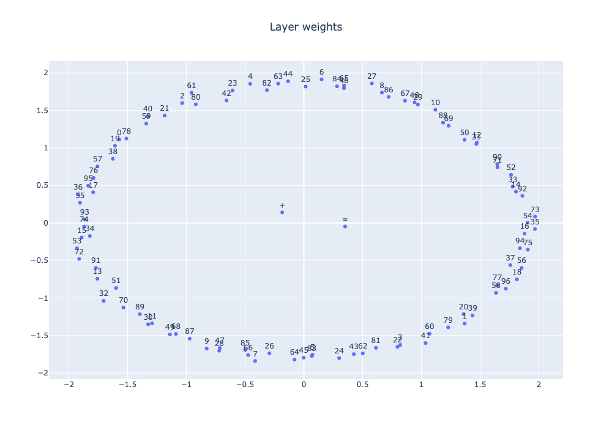

# Grokking MLP

This repo explores the grokking phenomenon that appears in neural networks trained on small datasets over many optimization steps. The code here replicates some of the results in OpenAI's Grokking paper: [Grokking: Generalization Beyond Overfitting on Small Algorithmic Datasets](https://arxiv.org/abs/2201.02177) and runs some experiments on variations of the idea. More related grokking papers are [The Slingshot Mechanism](https://arxiv.org/abs/2206.04817) and [Progress measures for grokking via mechanistic interpretability](https://arxiv.org/abs/2301.05217) and [A Tale of Two Circuits](https://arxiv.org/abs/2303.11873). The last paper talks about how grokking occurs due to a competition during training between a sparse model and a dense subnetwork and is explored in this repo.

The grokking phenomenon is something that occurs when training a neural network for a long period of time. Usually when training an overparameterized network on a small dataset the model will overfit the training data and fail to generalize to the validation data (i.e. very low training loss and very high validation loss). But, in some cases, when you continue training for a long period of time then the model will generalize and achieve perfect performance on the train and validation datasets. **The reason why this happens and if it can be exploited is an open question**.

The jupyter notebook `grokking-modadd.ipynb` is a playground notebook for building up experiments and was used for quick prototyping. The notebook demonstrates the grokking phenomenon on a simple MLP trained on a synthetically generated modular addition dataset. The rest of the `.py` files contain more structured code for running experiments.

## File Descriptions

* config.yaml: Configuration file for setting hyperparameters
* data.py: Creates synthetic datasets
* net.py: Defines the neural network architecture and set up loss function and optimizer
* plot.py: Contains helper functions for creating plots
* train.py: Main script used to train models and record results

## Experiment List

* **exp1**: Randomly split data into train and val set. Train over 100k optimization steps
* **exp2**: Randomly split data into train and val set. Train over 20k epochs
* **exp3**: Split data based on label (val set composed of data samples with labels 1 through 20). Train over 20k epochs
  * This is to see if the model will still grok (generalize) if it does not see certain data points. In other words, if it never sees any examples where the answer is between 0 and 20, will it still learn the true underlying equation? Or will it learn a variant of it that works for the other labels.
* **exp4**: Training on 5 random seeds and averaging results in plot. Train over 20k epochs.
  * Total experiment run time (cpu): ~45 minutes

TODO:
- [x] Have each experiment run 5x on different random seeds
- [ ] Track norm of weights for last layer. see if they are cyclic per apple research paper. A sharp phase transition should happen when the **model misclassifies training samples**. It is accompanied by a sudden spike in training loss.
- [ ] Maybe try increasing norm of last layer after loss plateaus to encourage grokking earlier?
- [ ] Plot the weight updates per epoch to see "speed" of learning during early stage of training, plateau stage, and grokking stage.
- [x] add type hinting

## Config settings

There is a config file which controls most of the settings for each experiment. Here is a brief description of what each setting does:

* experiment_name: Name of the experiment. Used to create a folder to store plots + model
* device: Which device to use (either cpu, cuda, or mps. **Note**: Only cpu has been tested)
* data:
  * p: Modulo parameter. (A \<operation\> B) % **p**. The larger this is, the more synthetic data there is to train on
  * operation: Arithmatic operation to use in modulo equation 
  * use_mask: Whether to use a mask when creating dataloaders. If true, then by default the mask will consist of data points where the label is < 20. In other words the training set will consist of data points where the label is greater than 20 (and up to **p**) and the validation set will contain only data points where the label is less than 20. **See exp3**
  * random_seeds: List of random seeds to use. Results will be averaged over all seeds and plotted
* model:
  * num_epochs: Total number of epochs to train on (per seed)
  * batch_size: Batch size to use
  * log_epoch: Every X epochs, log training statistics to stdout
* optim:
  * lr: Learning rate to use
  * betas: Betas to use for AdamW optimizer
* plot:
  * save_plots: Whether to save plots to png files or not

## Plots

Log Loss Plot from exp2 run:

Log Accuracy Plot from exp2 run:

Plot of embedding weights after dimensionality reduction from exp2 run:
